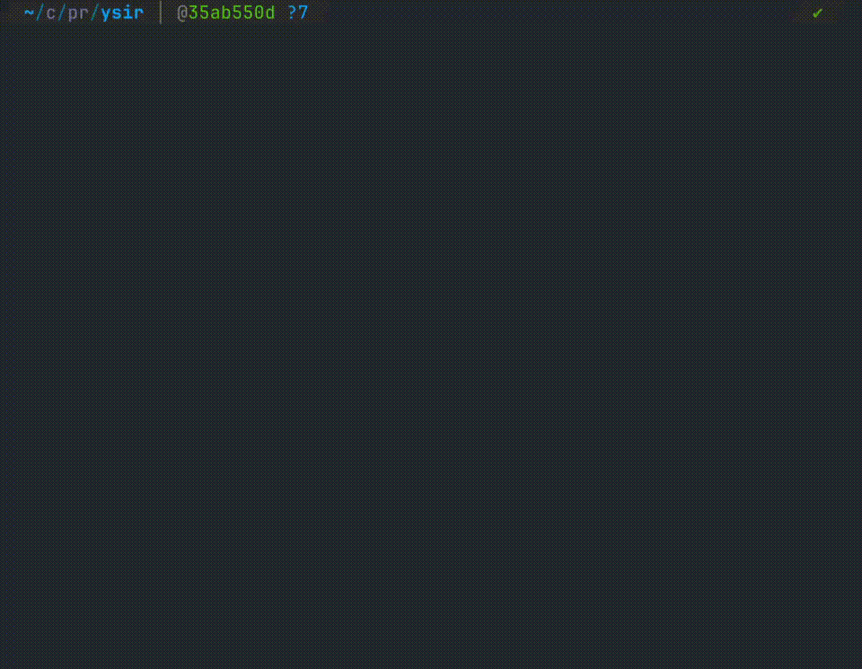

# Ysir

为编程助手提供稳定、可审计的交付能力。

> *Yes, Sir.*

## 概览

### 设计思想

相信 Agent 的智慧，以少量、清晰、稳定的工程化约束，为交付过程提供可靠边界。

### 目标

- 交付结果可用
- 交付过程清晰可追踪
- 需求、方案与实现保持一致
- 可作为后续维护与迭代的基础

### 工作原理

YSIR 将一组面向交付的工程约束拆成独立技能，并把它们接入编程助手。不同技能分别负责需求梳理、设计沉淀、实现规划、代码落地与符合性检查，避免将整个流程耦合在一次对话里。

[`ysir.js`](./ysir.js) 负责安装这些技能，[`skills/`](./skills) 定义各阶段行为规范，`.report/` 用来沉淀设计、计划、测试、审查和归档产物。实现阶段通过状态图推进，确保每次只处理当前节点，并在完成、返工和人工验收时留下明确轨迹。

## 快速开始

### 安装

```bash
git clone https://github.com/shflx/ysir.git
cd ysir
node ysir.js
```

<p align="center">
  
</p>

安装向导将引导你完成目标工具与安装目录配置。

### 使用

安装完成后，打开目标工具，即可通过技能名直接触发对应能力。

首次需要项目策略配置时，YSIR 会通过 `ysir-configure` 初始化 `ysir.yaml`，包括 human-in-the-loop 行为和软件开发方法。

```text
# 从0到1完成软件落地
$ysir 实现本地密码管理工具
```

```text
# 功能/机制详细设计
$ysir-design 设计加密机制
```

## 核心组成

### 技能介绍

| 技能 | 作用 |
| --- | --- |
| `ysir` | 默认总控技能，负责串联从需求到实现的端到端交付流程。 |
| `ysir-configure` | 负责管理 `ysir.yaml`，控制 human-in-the-loop 行为和软件开发方法。 |
| `ysir-understand` | 负责帮助 Agent 快速理解当前项目，梳理后续开发接手所需的关键信息。 |
| `ysir-design` | 负责项目设计或功能/机制设计，沉淀可复用的设计文档。 |
| `ysir-order` | 负责需求梳理，将模糊指令收敛为结构化需求结果。 |
| `ysir-plan` | 负责实现规划，选择软件方法 schema，并初始化可执行状态图。 |
| `ysir-moveout` | 负责按状态图分派 subagent 执行当前节点，并推进完成、返工和归档流程。 |
| `ysir-inspect` | 负责检查实现是否与设计、需求和方案保持一致，并在必要时推动整改。 |
| `ysir-state` | 负责维护任务过程中的阶段有向图，为其他技能提供可靠的进度门禁。 |
| `ysir-regulation` | 负责提供统一的项目文档空间、通用、开发、测试、审查和提交规范入口。 |
| `ysir-headquarters` | 负责启动本地只读动态网站，将 `.report` 渲染为给人查看的任务大屏。 |

### 产物

项目配置通过根目录 `ysir.yaml` 管理，用来控制人的参与程度和软件开发方法。文档产物默认围绕 `.report/` 组织：

```text
.report/
├── design/
│   ├── proj.md
│   └── {功能/机制名}.md
├── in-progress/{日期}-{需求简短描述}/
│   ├── order.md
│   ├── plan.md
│   ├── state.json
│   ├── test-round-{round}.md
│   └── cr-round-{round}.md
└── done/{日期}-{需求简短描述}/
```

- `design/`：沉淀项目设计与功能/机制设计文档
- `in-progress/`：记录当前进行中的需求文档、实现计划、状态图、测试与代码审查结果
- `done/`：归档已完成需求对应的过程文档

## License

MIT. 详见 [LICENSE](./LICENSE).
